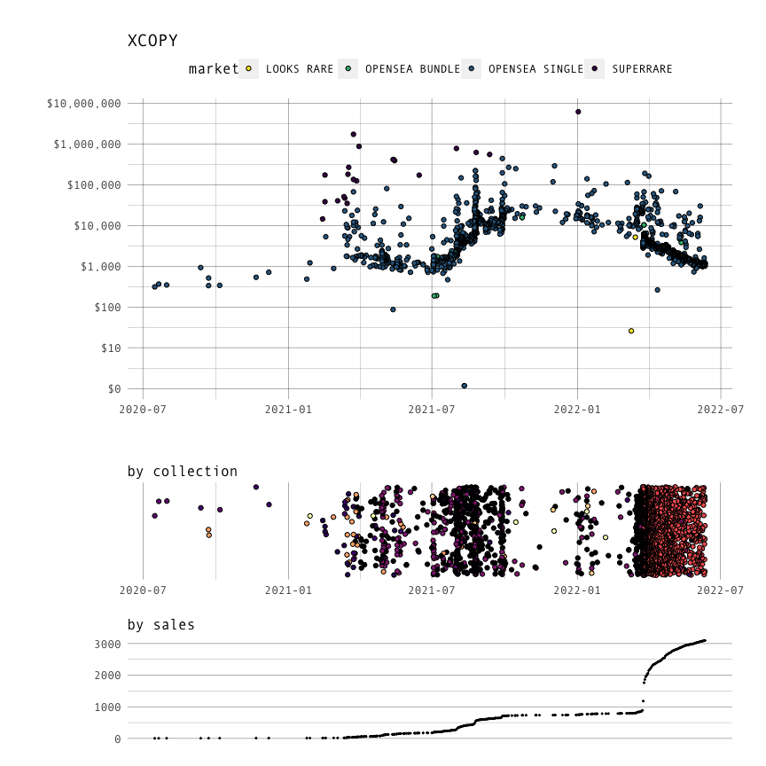

<!-- README.md is generated from README.Rmd. Please edit that file -->

# creator

A real-time sales historical tracker and dashboard for Web3 creators.

[](https://docs.zora.co/docs/zora-api/intro)

### Run

    npm install
    npm start

### Data Requirements

Data containing the `contract` and `token_id` for your creations.

`data/data.js`

    export const data = [
      {address: '0x41a322b28d0ff354040e2cbc676f0320d8c8850d', tokenId: '5'},
      {address: '0x41a322b28d0ff354040e2cbc676f0320d8c8850d', tokenId: '6'},
      {address: '0x41a322b28d0ff354040e2cbc676f0320d8c8850d', tokenId: '7'},
      ...
    ]  

This part can be challenging. For some contracts, simply querying mints
from a specific address cannot distinguish between *creating* and
*purchasing*. However, the Zora API can help, and this only needs to be
done once.

For contracts where only the creator mints:

``` python
import minted

XCOPY = "0x39cc9c86e67baf2129b80fe3414c397492ea8026"

SUPERRARE = [
  "0x41a322b28d0ff354040e2cbc676f0320d8c8850d",
  "0xb932a70a57673d89f4acffbe830e8ed7f75fb9e0"
]

minted.get_mints(minter_address=XCOPY, contracts=SUPERRARE)
```

                             collectionAddress  ...                    name
    0x41a322b28d0ff354040e2cbc676f0320d8c8850d  ...  Echoes of a Dead Earth
    0x41a322b28d0ff354040e2cbc676f0320d8c8850d  ...                 Feeding
    0x41a322b28d0ff354040e2cbc676f0320d8c8850d  ...             Greedy Guts
                                           ...  ...                     ...
    0xb932a70a57673d89f4acffbe830e8ed7f75fb9e0  ...              summer.jpg
    0xb932a70a57673d89f4acffbe830e8ed7f75fb9e0  ...                DANKRUPT
    0xb932a70a57673d89f4acffbe830e8ed7f75fb9e0  ...                   DECAY

Note: The Zora API has a response limit of 500 max entities for this
type of query, but we can recursively query the next page of data (if it
exists) up to a recursion depth of 50 (default). Thus `get_mints` can
retrieve up to 25,000 entities.

For contracts where the creator does not mint:

``` python
import minted

CONTRACTS = ["0x6d4530149e5b4483d2f7e60449c02570531a0751"]

minted.get_search(text="XCOPY", contracts=CONTRACTS)
```

                             collectionAddress  ...                     name
    0x6d4530149e5b4483d2f7e60449c02570531a0751  ...     SAINT_LESS (Fire) #1
    0x6d4530149e5b4483d2f7e60449c02570531a0751  ...     SAINT_LESS (Fire) #1
    0x6d4530149e5b4483d2f7e60449c02570531a0751  ...     SAINT_LESS (Fire) #2
                                           ...  ...                      ...
    0x6d4530149e5b4483d2f7e60449c02570531a0751  ...  SAINT_LESS (Waves) #198
    0x6d4530149e5b4483d2f7e60449c02570531a0751  ...  SAINT_LESS (Waves) #199
    0x6d4530149e5b4483d2f7e60449c02570531a0751  ...  SAINT_LESS (Waves) #200

### Data Examples

The Zora API is **powerful**. While the demo includes a small sample of
XCOPY’s work, more NFTs could be tracked. The historical queries
presented were tested for up to 10,000 tokens at a time. After that,
there is some latency between calls, some may fail likely to due too
much data. An alternative approach could be to split up queries into
small token batches. This probably will not be a problem for most
creators.

``` r
p1 <- df %>%
  ggplot(aes(x=day, y=price, fill=market)) +
  geom_point(shape=21, color="#000000") +
  labs(title="XCOPY", x="", y="", color="") +
  scale_fill_viridis_d(direction=-1) +
  scale_y_continuous(trans="pseudo_log", 
                     labels=scales::label_dollar(),
                     breaks=c(0, 1e1, 1e2, 1e3, 1e4,1e5,1e6, 1e7)) +
  theme(
    plot.margin=unit(c(1,1,1,1), "cm"),
    text=element_text(size=12,  family="Andale Mono"),
    panel.background=element_blank(),
    legend.position="top",
    panel.grid=element_line(color="#00000090", size=0.2),
    axis.ticks=element_blank()
  )

p2 <- df %>%
  ggplot(aes(x=day, y=1, fill=collection)) +
  geom_jitter(shape=21, color="#000000") +
  labs(x="", y="", color="", subtitle="by collection") +
  scale_fill_viridis_d(option="magma", direction=-1) +
  scale_y_continuous(trans="pseudo_log", 
                     labels=scales::label_dollar(),
                     breaks=c(0, 1e1, 1e2, 1e3, 1e4,1e5,1e6, 1e7)) +
  theme(
    text=element_text(size=12,  family="Andale Mono"),
    panel.background=element_blank(),
    legend.position="none",
    panel.grid=element_line(color="#00000090", size=0.2),
    axis.ticks=element_blank()
  )

p3 <- df %>%
  dplyr::group_by(day) %>%
  dplyr::summarise(n=n()) %>%
  dplyr::arrange(day) %>%
  dplyr::mutate(total=cumsum(n)) %>%
  ggplot(aes(x=day, y=total)) +
  geom_point(size=0.3) +
  labs(x="", y="", color="", subtitle="by sales", caption="data from Zora API") +
  theme(
    text=element_text(size=12,  family="Andale Mono"),
    panel.background=element_blank(),
    legend.position="none",
    panel.grid=element_line(color="#00000090", size=0.2),
    panel.grid.major.x=element_blank(),
    panel.grid.minor.x=element_blank(),
    axis.ticks=element_blank(),
    axis.text.x=element_blank()
  )

ggpubr::ggarrange(
  p1, 
  p2, 
  p3, 
  nrow=3, 
  align="v", 
  heights=c(0.6, 0.2 ,0.2),
  common.legend=F)
```

<!-- -->
